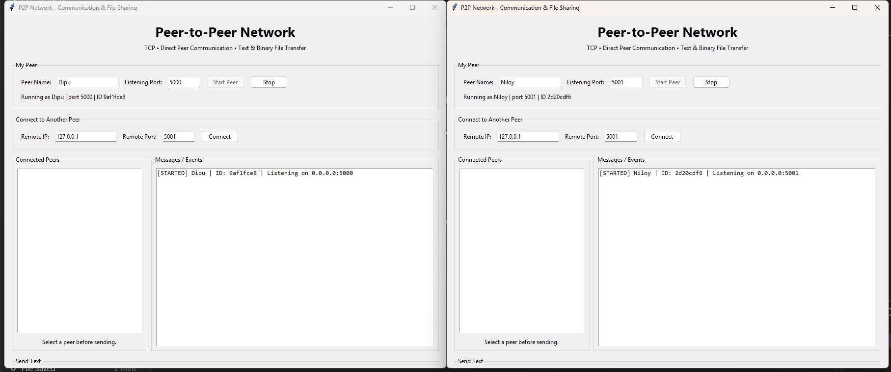
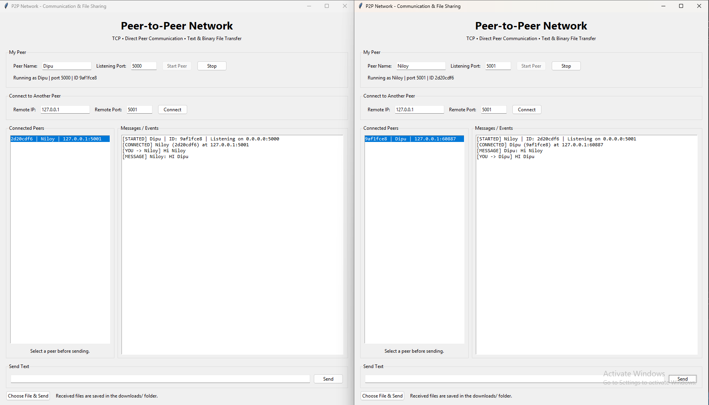
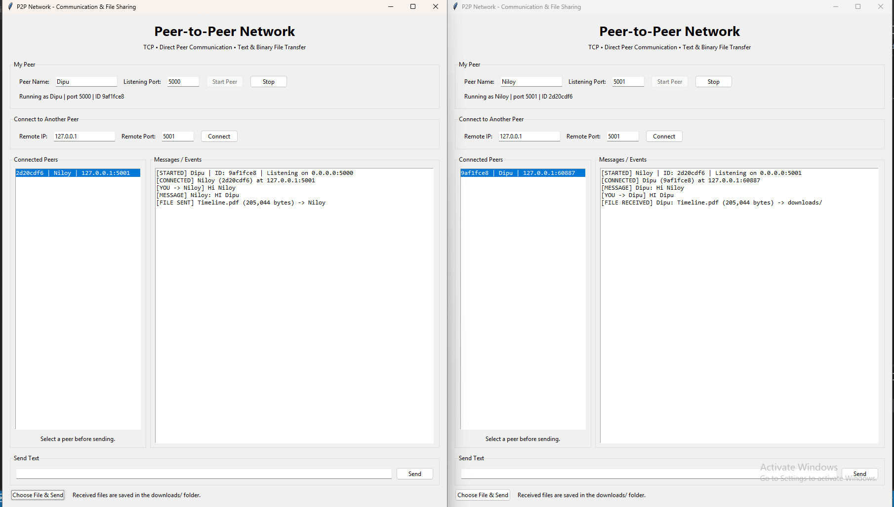

# P2P Network - Communication and File Sharing

A lightweight peer-to-peer communication application built with Python TCP sockets.

Each running application is a **peer** and can act as both:

- TCP server: accepts incoming peer connections
- TCP client: connects to other peers

There is **no central server**.

## Features

- Peer name and listening port
- TCP server and client
- HELLO handshake
- Connected peer list
- Direct text messaging
- Binary file transfer
- Images, audio, video, PDF, ZIP, text and other ordinary files
- File transfer in 64 KB chunks
- Multiple peer connections
- Thread-based connection handling
- Basic network error handling
- Tkinter graphical interface
- Received files saved in `downloads/`

## Project Structure

```text
P2P_Network/
│
├── main.py
├── p2p_node.py
├── protocol.py
├── requirements.txt
├── README.md
└── downloads/
```

## Requirements

- Python 3.9 or later
- Windows, Linux or macOS
- No third-party Python package is required

Tkinter is normally included with standard Python on Windows and macOS. On some Linux distributions it may need to be installed separately.

## Run

Open a terminal in the project directory:

```bash
python main.py
```

## Test Two Peers on One Computer

### Peer A

Start the first application:

```text
Peer Name: Dipu
Listening Port: 5000
```

Click **Start Peer**.

### Peer B

Open a second terminal and run:

```bash
python main.py
```

Use:

```text
Peer Name: Niloy
Listening Port: 5001
```

Click **Start Peer**.

Then Niloy connects to:

```text
Remote IP: 127.0.0.1
Remote Port: 5000
```

Click **Connect**.

Dipu and Niloy should appear in each other's connected-peer list.

## Send Text

1. Select the connected peer.
2. Type a message.
3. Click **Send**.

Example:

```text
Dipu -> Niloy: Hello Niloy!
Niloy -> Dipu: Hello Dipu!
```

## Send a File

1. Select a connected peer.
2. Click **Choose File & Send**.
3. Select an image, audio, video, PDF, ZIP, text file, etc.

The receiver stores the file in:

```text
downloads/
```

If a file with the same name already exists, a number is added:

```text
photo.jpg
photo_1.jpg
photo_2.jpg
```

## Test Three Peers

Run three application instances:

```text
Dipu    5000
Niloy   5001
Roy     5002
```

For example:

```text
Niloy -> Dipu     127.0.0.1:5000
Roy   -> Dipu     127.0.0.1:5000
```

You can also create a connection between Niloy and Roy:

```text
Niloy -> Roy      127.0.0.1:5002
```

Then test communication between different pairs.

## Test on Two Computers

Connect both computers to the same LAN/Wi-Fi.

Suppose:

```text
Computer A:
IP = 192.168.1.10
Port = 5000

Computer B:
IP = 192.168.1.11
Port = 5001
```

Start Dipu on Computer A:

```text
Name: Dipu
Port: 5000
```

Start Niloy on Computer B:

```text
Name: Niloy
Port: 5001
```

From Niloy, connect to:

```text
Remote IP: 192.168.1.10
Remote Port: 5000
```

## Screenshots

### 1. Main Application Interface


**Description:**  
This screenshot shows the main graphical interface of the P2P application. 
It contains the peer name, listening port, connection controls, connected 
peer list, text messaging area, and file transfer option.

### 2. Peer-to-Peer Connection



**Description:**  
This screenshot shows two peers connected directly using TCP sockets. 
Dipu is running on port 5000 and Niloy is running on port 5001. 
The connected peer is displayed in the peer list.

### 3. Text Communication



**Description:**  
This screenshot demonstrates direct text communication between two connected 
peers. A message sent from one peer is received and displayed by the other peer.

### 4. File Transfer



**Description:**  
This screenshot demonstrates binary file transfer between two peers. 
The selected file is sent directly to the connected peer and the received 
file is saved in the `downloads/` folder.